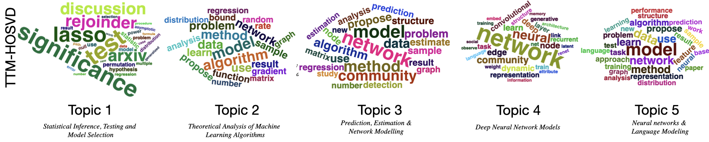

# Tensor Topic Modeling via HOSVD

This repository contains code for **Tensor Topic Modeling via HOSVD**, described in [arXiv:2501.00535](https://arxiv.org/abs/2501.00535). The project estimates topic models for tensor-shaped data using a Tucker/HOSVD-based approach, recovering mode-specific latent factors, topic-token structure, and a core tensor that summarizes interactions among latent factors.

## TTM-HOSVD On One Dataset

We consider tensor-valued topic data indexed by two structural modes and one vocabulary mode. For each cell formed by a pair of mode-1 and mode-2 indices, the observed words are summarized by an empirical distribution over a vocabulary of size `R`. Stacking these cell-level distributions gives the empirical probability tensor `D`, an `rTensor` object with shape `Q1 x Q2 x R`.

Equivalently, the mode-3 matricization of `D` has shape `R x (Q1 * Q2)`: each column corresponds to one tensor cell, and each row corresponds to one token or feature. If the data are initially stored as a count matrix `Y3`, normalize each column of `Y3` to sum to one and then tensorize the resulting matrix into `D`.

```r
fit_ttm_hosvd_method(
  data = list(D = empirical_probability_tensor),
  K1 = 2,
  K2 = 2,
  K3 = 4,
  M = median_column_count,
  vh_method = "SP"
)
```

The output `fit` contains the estimated mode factors `fit$A1`, `fit$A2`, and `fit$A3`, together with the estimated Tucker core tensor `fit$core`. In this representation, `A3` gives the topic-token structure, `A1` and `A2` describe the latent structure along the two non-token modes, and the core tensor summarizes how the mode-specific latent factors interact.

## Identifiability Example

Identifiability can also be inspected through a split-half stability experiment. Starting from the observations used to construct the empirical tensor `D`, split the samples or counts within each tensor cell into two independent halves, construct two empirical tensors `D_half1` and `D_half2`, and fit TTM-HOSVD to each half:

```r
fit_half1 <- fit_ttm_hosvd_method(
  data = list(D = D_half1),
  K1 = 2,
  K2 = 2,
  K3 = 4,
  M = median_column_count_half1,
  vh_method = "SP"
)

fit_half2 <- fit_ttm_hosvd_method(
  data = list(D = D_half2),
  K1 = 2,
  K2 = 2,
  K3 = 4,
  M = median_column_count_half2,
  vh_method = "SP"
)
```

The estimated factors are identifiable only up to permutation of latent components, so the comparison should first align the columns of `fit_half1$A1`, `fit_half1$A2`, and `fit_half1$A3` with the corresponding columns from `fit_half2`. Stable recovery means that the aligned mode factors and core tensors are close across the two halves.

## ArXiv Abstract Example

We also include a real-data example based on arXiv abstracts from 21 senior researchers in statistics and machine learning. The preprocessing constructs an author-year-word tensor from the Kaggle arXiv metadata snapshot, then applies TTM-HOSVD to estimate topic-word structure.

```bash
python real_data/arxiv_prepare_corpus.py \
  --metadata /path/to/arxiv-metadata-oai-snapshot.json \
  --output-dir results/arxiv_ttm_hosvd \
  --start-year 2005 --end-year 2024 \
  --per-year 3 --max-vocab 500 --min-total-count 5

Rscript real_data/arxiv_ttm_hosvd.R \
  prepared_dir=results/arxiv_ttm_hosvd \
  output_dir=results/arxiv_ttm_hosvd \
  K1=5 K2=3 K3=5 svd_backend=rsvd
```



The word clouds summarize the estimated topic-word factor matrix. Larger words have larger topic loadings, and the short labels below each topic are interpretive summaries of the dominant words.
